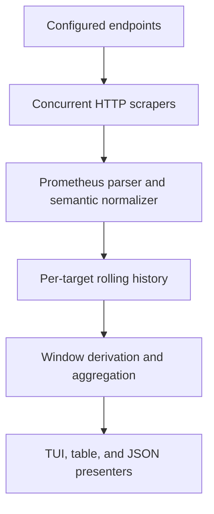

# gpttop

`gpttop` is a lightweight terminal monitor for one or more
[vLLM](https://github.com/vllm-project/vllm) deployments. It scrapes each
deployment's Prometheus-compatible `/metrics` endpoint, keeps a short rolling
history in memory, and presents operational metrics as compact, numeric-first
terminal tables.

## Why

vLLM already exposes the data needed to understand request pressure, cache
pressure, throughput, and latency. The usual Prometheus + Grafana setup is
excellent for permanent production monitoring, but it is heavy when the job is
simply:

```text
SSH into a server -> point at several vLLM endpoints -> see what is happening
```

`gpttop` is designed for that workflow while preserving correct Prometheus
semantics. Counters become rates, gauges become current values and
time-weighted averages, and histogram percentiles are calculated from bucket
deltas inside each requested time window.

## Features

- Monitor multiple vLLM base URLs concurrently.
- Discover model names from the `model_name` metric label.
- Show an endpoint/model overview and a detailed windowed view.
- Keep rolling statistics for the current window and the last 1, 5, and
  15 minutes.
- Show 15-minute minimum and maximum values for each detailed metric using the
  same type-aware current-window semantics as `now`.
- Handle counter resets, process restarts, missing metrics, scrape failures,
  and partial warm-up windows.
- Support both current and legacy vLLM metric names through a semantic alias
  registry.
- Provide interactive TUI, one-shot table, and JSON output modes.
- Build into a self-contained executable with the included `Makefile`.
- Run without a live server using a deterministic `--demo` mode.

## Quick start

Requirements for building:

- Go 1.18 or newer
- GNU Make

Cross-building macOS arm64 artifacts requires a Go toolchain whose standard
library can target `darwin/arm64`. The Makefile honors `GO=/path/to/go` and, in
this workspace, automatically uses an ignored `.tools/go1.26.5/bin/go` if it is
present.

Build and run:

```bash
make build

./bin/gpttop \
  --endpoint local=http://127.0.0.1:8000 \
  --endpoint gemma=http://10.0.0.42:8000
```

An endpoint may be a base URL or a full metrics URL. `/metrics` is appended
when the URL does not already contain an explicit path.

Run without building first:

```bash
go run ./cmd/gpttop --endpoint http://127.0.0.1:8000
```

Preview the interface without vLLM:

```bash
./bin/gpttop --demo
```

When stdout is not a terminal, `--demo` renders the same deterministic data in
one-shot table or JSON mode and exits. In a terminal it opens the interactive
TUI.

## Interface

### Overview

The default screen contains one row per endpoint and model:

```text
  MODEL              ENDPOINT       STATE   RPS(req/s)  RUN(req)  WAIT(req)  PROMPT(tok/s)  GEN(tok/s)  HIT(%)  KV(%)  CPU(cores)  TTFT95(s)  E2E95(s)  ERR(count)
> gemma-3-27b-it     gpu01:8000     [UP]           3.7       132        119          310.0        42.0     9.4   98.0        1.25       0.21      7.20           0
  qwen2.5-7b         gpu02:8000     [STALE]       11.2        18          0          880.0       196.0    43.1   61.3           -       0.21      7.20           1
```

Units are part of the header. Data cells stay numeric so colored and uncolored
rows align the same way. Narrow terminals hide complete lower-priority columns
instead of clipping partial columns.

### Detail view

Press `Enter` on an endpoint to open its numeric detail view:

```text
gpttop | detail | google/gemma-3-27b-it @ gpu01

METRIC                         NOW       1m       5m~     15m~  MIN 15m~  MAX 15m~
RPS, req/s                     3.7      3.6      3.3      3.1       1.2       8.4
Requests running               132      128      111       94        72       146
Requests waiting               119       96       71       58         0       138
Prompt throughput, tok/s     310.0    304.0    292.0    281.0     120.0     899.8
Generation throughput, tok/s  42.0     44.0     41.0     39.0       8.0     160.0
Prefix-cache hit, %            9.4      9.8     11.2     13.6       0.0      58.2
KV-cache usage, %             98.0     96.4     91.8     86.2      55.1      99.2
API CPU, cores                 1.25     1.18     1.09     1.02      0.40      2.80
TTFT p95, s                    0.21     0.24     0.31     0.35     >0.12      1.48
```

Values above are illustrative; the tool does not ship with hard-coded
deployment data. A `~` on a detail column header, such as `5m~`, means that
window is still warming up; cells stay numeric.

The detail table folds meaningful units into the metric name, such as
`TTFT p95, s` or `KV-cache usage, %`. Plain request gauges keep their natural
names, for example `Requests running`, without an added `req` suffix.

### Outcome view

Request outcomes are kept separate so that a normal length-limited completion,
a client abort, and an HTTP server error are not mashed into one misleading
number. The 1m, 5m, and 15m selections are rolling counts, not per-second
rates. A `~` after the selected window means `gpttop` has not yet observed that
window's full duration. The `all` selection is a reset-safe cumulative count
observed since `gpttop` started:

```text
Selected window: 5m

OK
  stop                         1,080
  length                          12

NOT OK / INCOMPLETE
  abort                            3
  HTTP 4xx                         1  POST /v1/chat/completions
  HTTP 5xx                         0
  corrupted request                0
```

The vLLM metrics endpoint normally exposes HTTP status classes and completion
reasons, not exception messages. When no bounded `error_type` or equivalent
label exists, `gpttop` must report `reason unavailable` rather than inventing
one.

### Keys

| Key | Action |
| --- | --- |
| `Up` / `Down`, `j` / `k` | Select an overview row; scroll details when needed |
| `Enter` | Open or close endpoint details |
| `Esc` | Return to overview or close help |
| `1` / `2` / `3` / `4` | Select 1m / 5m / 15m / all-time outcomes |
| `o` | Open request outcome breakdown |
| `m` | Toggle endpoint and model-grouped overview |
| `r` | Force an immediate scrape |
| `?` | Show help |
| `q`, `Ctrl+C` | Quit and restore the terminal |

## Configuration

CLI endpoints can be combined with a YAML configuration file:

```yaml
refresh_interval: 2s
scrape_timeout: 3s
current_window: 10s
history: 20m
windows: [1m, 5m, 15m]

endpoints:
  - name: gemma-prod
    url: http://10.0.0.42:8000
    metrics_path: /metrics

  - name: qwen-prod
    url: https://inference.example.net
    metrics_path: /metrics
    headers:
      Authorization: "Bearer ${gpttop_TOKEN}"
```

Environment variables are expanded in configuration values at runtime. Header
values and URL user information must never be printed, logged, or included in
JSON output.

Run with the configuration:

```bash
./bin/gpttop --config ./gpttop.yaml
```

Repeated CLI `--endpoint` values are appended to configured endpoints. Endpoint
names must be unique after configuration is merged. `history` must be at least
15 minutes, and `current_window` must be greater than or equal to the scrape
interval.

## CLI

```text
gpttop [flags]

  -e, --endpoint [NAME=]URL    vLLM base or metrics URL; repeatable
  -c, --config PATH            YAML configuration file
  -i, --interval DURATION      scrape interval, default 2s
      --timeout DURATION       per-endpoint scrape timeout, default 3s
      --current-window DUR     window used for "now" rates, default 10s
      --history DURATION       in-memory retention, default 20m
      --once                   collect a short sample and exit
      --sample-duration DUR    delay between --once scrapes, default 2s
      --output table|json      output format for --once, default table
      --demo                   run against deterministic synthetic data
      --no-color               disable ANSI colors
      --version                print version, commit, and build date
  -h, --help                   show help
```

Interactive mode requires a TTY. When stdout is not a TTY, callers should use
`--once --output table` or `--once --output json`.

JSON output is stable for automation. Each metric row contains `now`,
`one_min`, `five_min`, `fifteen_min`, `min_fifteen_min`, and
`max_fifteen_min`; unavailable values are serialized as `null`.

## Metric semantics

`gpttop` deals in semantic metrics rather than binding the UI directly to one
vLLM release's exact exposition names.

| Display value | Primary source | Calculation |
| --- | --- | --- |
| Model | `model_name` label | Metadata; falls back to `<unknown>` |
| Endpoint | Configuration | Sanitized configured name and URL |
| Request rate | `vllm:request_success_total` | Sum of non-negative counter deltas divided by observed time |
| Requests running | `vllm:num_requests_running` | Latest gauge; time-weighted mean for historical windows |
| Requests waiting | `vllm:num_requests_waiting` | Latest gauge; time-weighted mean for historical windows |
| Prompt throughput | `vllm:prompt_tokens_total` | Counter rate in tokens/s |
| Generation throughput | `vllm:generation_tokens_total` | Counter rate in tokens/s |
| Prefix-cache hit | `vllm:prefix_cache_hits_total` and `vllm:prefix_cache_queries_total` | `delta(hits) / delta(queries)` for the same window |
| KV-cache usage | `vllm:kv_cache_usage_perc` | Gauge multiplied by 100 |
| API CPU | `process_cpu_seconds_total` | CPU-second counter rate; `1.0` means one fully used core |
| Queue p95 | `vllm:request_queue_time_seconds` | p95 from bucket deltas |
| Prefill p95 | `vllm:request_prefill_time_seconds` | p95 from bucket deltas |
| Decode p95 | `vllm:request_decode_time_seconds` | p95 from bucket deltas |
| Inference p95 | `vllm:request_inference_time_seconds` | p95 from bucket deltas |
| TTFT p50/p95 | `vllm:time_to_first_token_seconds` | Quantiles from bucket deltas |
| ITL p50/p95 | `vllm:inter_token_latency_seconds` | Quantiles from bucket deltas |
| E2E p50/p95 | `vllm:e2e_request_latency_seconds` | Quantiles from bucket deltas |
| Outcomes | `vllm:request_success_total`, `http_requests_total`, `vllm:corrupted_requests_total` | Window deltas grouped by bounded labels |
| Preemptions | `vllm:num_preemptions_total` | Window rate and count |

Compatibility aliases include:

- `vllm:gpu_cache_usage_perc` for older KV-cache usage exports.
- `vllm:gpu_prefix_cache_hit_rate` when only a legacy hit-rate gauge exists.
- `vllm:time_per_output_token_seconds` when the newer inter-token latency
  histogram is absent.

An absent metric is displayed as `-`, never as zero.

### What “now”, 1m, 5m, and 15m mean

Applying the same averaging rule to every Prometheus type produces bad
numbers. `gpttop` uses type-aware calculations:

- **Gauge:** `now` is the newest scrape; historical columns are time-weighted
  means. A sampling gap longer than `2.5 * refresh_interval` is treated as
  uncovered time rather than carrying a stale value.
- **Counter:** every column is a reset-safe rate over that window. `now` uses
  `current_window`, which defaults to 10 seconds.
- **Ratio of counters:** numerator and denominator are independently
  accumulated over the window, then divided.
- **Histogram:** buckets are differenced over the window and then passed to
  Prometheus-compatible quantile interpolation. Percentiles are never averaged.
- **Outcome count:** non-negative counter deltas are summed within the selected
  window.

Conceptually:

```text
p95(window) = histogram_quantile(
  0.95,
  buckets(now) - buckets(window_start)
)
```

If the process restarts or a counter decreases, only valid non-negative deltas
from the new counter epoch are used. The crossing interval is skipped and the
new sample becomes the next baseline. A window that has not fully warmed up is
marked as partial: the interactive detail view marks the affected column header,
for example `5m~`, while machine-readable JSON keeps per-value partial metadata.
Histograms cannot reveal an individual request's “latest” latency; `now`
therefore means a quantile over the current rolling window. When a quantile
lands in the `+Inf` bucket, the value is rendered as bounded by the previous
finite bucket, for example `>5.00`.

### 15-minute extrema

The detail table's `MIN 15m` and `MAX 15m` columns are extrema over time of the
same derived signal shown in `NOW`. For every successful scrape timestamp in
the latest 15-minute horizon, `gpttop` derives the metric using the configured
`current_window` and then takes the minimum and maximum available values.

- Gauges use the endpoint/model aggregate observed at each successful scrape.
- Counter rates, API CPU, and prefix-cache ratios use reset-safe current-window
  deltas, never lifetime totals.
- Histogram extrema use current-window quantiles from bucket deltas.
- Missing, `NaN`, infinite, zero-query, reset-crossing, and no-observation
  candidates are skipped rather than converted to zero.
- Short warm-up history marks the extrema columns with `~`, the same partial
  marker used by other windows.

### Aggregating replicas

Aggregation is metric-aware:

- Request counts, rates, token throughput, CPU, running requests, and waiting
  requests are summed.
- Prefix-cache hit rate is calculated from summed hit and query deltas.
- Histogram bucket deltas are summed before calculating percentiles.
- KV-cache usage shows both average and maximum pressure in model-grouped
  details.
- Replica percentiles are never averaged together.

Phase p95 values are shown side by side. They must not be stacked or summed:
the p95 queue request is not necessarily the p95 decode request.

## Architecture



Suggested package boundaries:

```text
cmd/gpttop/        executable and CLI wiring
internal/config/    flags, YAML, validation, environment expansion
internal/scrape/    concurrent HTTP collection and target health
internal/prom/      exposition parsing and semantic metric aliases
internal/history/   bounded per-target sample storage
internal/derive/    gauge, counter, ratio, and histogram window math
internal/aggregate/ replica and model rollups
internal/ui/        Bubble Tea numeric terminal interface
internal/output/    one-shot table and JSON rendering
internal/buildinfo/ linker-injected version metadata
internal/testdata/  representative current and legacy vLLM metrics
```

Scraping, history, derivation, and presentation communicate through explicit
interfaces so that the TUI and calculations can be tested without network
access or a real terminal.

## Build and distribution

The repository includes a `Makefile` and commits both `go.mod` and `go.sum`.
Runtime builds must not require Python, CUDA, vLLM, Prometheus, or Grafana.

```bash
make build       # bin/gpttop for the current platform
make test        # unit and integration tests
make test-race   # Go race detector
make check       # format check, go vet, tests, and build
make build-all   # Linux/macOS, amd64/arm64 binaries under dist/
make release VERSION=v0.1.0  # archives plus SHA-256 checksums under dist/
make install     # install to PREFIX/bin; PREFIX defaults to /usr/local
make clean
```

Release builds use `CGO_ENABLED=0`, `-trimpath`, and linker-injected version,
commit, and build-date information. At minimum, `make build` must produce an
executable that passes:

```bash
./bin/gpttop --version
./bin/gpttop --help
./bin/gpttop --demo
```

## Testing requirements

The implementation is expected to cover:

- Current vLLM metrics with colon-containing names and histogram labels.
- Legacy metric aliases.
- Gauge means across irregular scrape intervals.
- Counter rates with resets and process restarts.
- Prefix hit rates from counter deltas.
- Histogram p50/p95 calculation from windowed bucket deltas.
- Multiple replicas with correct histogram merging.
- Partial warm-up windows and windows with no observations.
- One endpoint being slow, malformed, or unavailable while others remain live.
- URL/header redaction.
- Terminal resize, narrow layouts, keyboard actions, and clean shutdown.
- Deterministic `--once`, JSON, and `--demo` behavior.

An integration test should use `httptest.Server` to serve a sequence of metric
snapshots, including at least one counter reset.

## Known limitations

- Direct-scrape history is in memory and is lost when `gpttop` exits.
- Histogram quantiles are estimates bounded by the bucket resolution exported
  by vLLM.
- `process_cpu_seconds_total` represents the exposed API process, not
  necessarily every process or container in a deployment. It can be absent in
  multi-process configurations.
- `/metrics` does not normally expose precise exception reasons or individual
  request traces.
- Host CPU, GPU utilization, VRAM, temperature, and power require an additional
  source such as cAdvisor, node-exporter, or DCGM and are outside the first
  release.
- Durable graphs, alerts, and long-term historical analysis belong in
  Prometheus/Grafana or a similar monitoring stack, not in `gpttop`.

## Non-goals for the first release

- Replacing Prometheus/Grafana for durable storage, alerts, or fleet-wide SLOs.
- Inspecting prompts, generated text, or request payloads.
- Generating load or benchmarking the server.
- Modifying or importing vLLM.
- Depending on another vLLM monitoring TUI.

The internal data-source interface should leave room for a future Prometheus
query backend, persistent recording, DCGM metrics, and structured error-log
integration without coupling those features to the first release.
